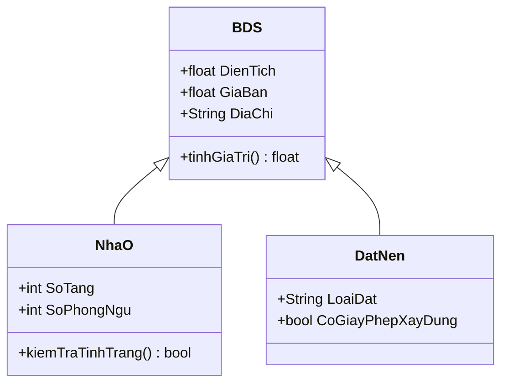

# Sơ đồ Bất Động Sản

Dưới đây là thiết kế class diagram của hệ thống:

```mermaid
classDiagram
  class BDS {
    +float DienTich
    +float GiaBan
    +String DiaChi
    +tinhGiaTri() float
  }

  class NhaO {
    +int SoTang
    +int SoPhongNgu
    +kiemTraTinhTrang() bool
  }

  class DatNen {
    +String LoaiDat
    +bool CoGiayPhepXayDung
  }

  BDS <|-- NhaO 
  BDS <|-- DatNen 
```